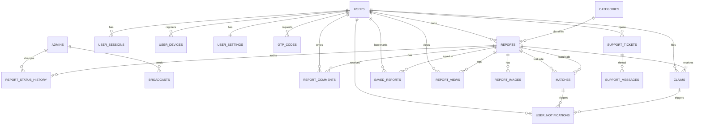

# BackToOwner — Mobile App Database Architecture

Design record for the mobile app backend in this folder, which serves the Flutter client at the
repository root.

- Status: **implemented**. See [readme.md](readme.md) for setup and the API reference.
- Last updated: 2026-09-09

## The architecture decision

Two rounds of revision landed here. The shape actually built is:

> A **monorepo**: the Flutter client and its backend in one repository (`App/` and `App/backend/`),
> running as its own service, **sharing the admin dashboard's SQLite database**.
> `Backend/` was not modified.

What that means in practice:

- Two services, two ports (admin 5000, app 5001), **one database file**:
  `Backend/data/admin.sqlite`.
- A report filed from the phone appears in the web dashboard, and dashboard edits are visible in
  the app. That is the point of sharing.
- Match suggestions from the app land in the dashboard's existing approval queue as
  `pending_admin_approval`. Users are notified only once an admin approves — detected by a sweep,
  because the approval happens in the other process and `Backend/` has no hook to add.
- The app's per-user inbox is `user_notifications`; `notifications` stays the dashboard's
  geo-broadcast table.
- The extra columns the app needs on `users`, `reports`, `categories` and `matches` are added at
  runtime by `ensureColumns()`, all nullable or constant-defaulted, so the dashboard is unaffected.

The section numbering below is from the original proposal and is kept as the design record. Where
it and `backend/readme.md` disagree, the readme describes what was built.

---


## 2. Current state audit

### 2.1 What the backend already has

| Table | Purpose | Reusable for mobile? |
|---|---|---|
| `admins` | admin accounts + bcrypt hash + JWT | Admin only — untouched |
| `categories` | 9 seeded categories, icon + colour | Yes — needs `emoji`, `bg_hex` for app cards |
| `users` | citizens, but **no password, no auth** | Yes — extend into a real auth-capable table |
| `reports` | lost/found items, JSON `images`, JSON `verification_details` | Yes — needs `owner_user_id` |
| `matches` | lost↔found candidate pairs + admin approval | Yes — needs auto-generation + user notify |
| `notifications` | **admin broadcasts only** (global, geo-radius) | Keep as broadcasts; add per-user table |

### 2.2 What the Flutter app needs that does not exist yet

Read off the actual screens in `App/lib`:

| Flutter screen / widget | Data it needs | Gap |
|---|---|---|
| `auth_screen.dart` | email, password, phone, **ID verification**, Google sign-in | `users` has no `password_hash`, no `google_id`, no ID field |
| `dashboard_screen.dart` | feed, quick actions, "Items Returned / Active Cases / Success Rate" | No app-facing stats endpoint |
| `report_item_modal.dart` | title, location, reward, image (camera/gallery) | No per-user report ownership, no multi-image table |
| `my_reports_screen.dart` | *this user's* reports | `reports` has no `owner_user_id` — **blocker** |
| `notifications_screen.dart` | per-user notifications: match / comment / returned / info / reminder | `notifications` is a global broadcast table |
| — "Sara left a comment on your report" | comment threads | No comments table |
| — "Item Marked as Returned" | claim + handover flow | No claims table |
| — "viewed 24 times this week" | view counter | No view tracking |
| `profile_screen.dart` / `edit_profile_screen.dart` | first name, last name, email, mobile, avatar upload | `users.name` is one field; no avatar upload route |
| `privacy_security_screen.dart` | change password | No user password at all |
| `help_support_screen.dart` | hotline, email, live chat, FAQs, social links | Hard-coded in Dart — should be server-driven |
| Push notifications (planned) | FCM device tokens | No devices table |

### 2.3 What the Flutter app already got right

`App/lib/services/` is written against **interfaces**, not implementations:

- `IAuthService` ← `MockAuthService`
- `IReportRepository` (`IReportReader` + `IReportWriter`) ← `InMemoryReportRepository`

That is a clean dependency-inversion seam. Wiring the real API means writing `ApiAuthService`
and `ApiReportRepository` and changing **one line** in `main.dart`. No screen or view-model has
to change for the swap itself.

---

## 3. Database architecture

### 3.1 Entity-relationship overview



### 3.2 Layer map

| Layer | Tables |
|---|---|
| **Identity** | `admins`, `users`, `user_sessions`, `user_devices`, `user_settings`, `otp_codes` |
| **Catalogue** | `categories`, `faqs`, `app_config` |
| **Core domain** | `reports`, `report_images`, `report_status_history` |
| **Engagement** | `report_comments`, `report_views`, `saved_reports` |
| **Resolution** | `matches`, `claims` |
| **Messaging** | `user_notifications`, `broadcasts` (renamed `notifications`), `support_tickets`, `support_messages` |
| **Ops** | `audit_logs`, `schema_migrations` |

---

## 4. Schema changes to existing tables

All changes are **additive** — nothing the admin panel reads is removed or renamed, except the
`notifications` → `broadcasts` rename, which is handled with a compatibility view (§4.5).

### 4.1 `users` — turn it into a real auth table

```sql
ALTER TABLE users ADD COLUMN first_name          TEXT;
ALTER TABLE users ADD COLUMN last_name           TEXT;
ALTER TABLE users ADD COLUMN password_hash       TEXT;          -- NULL = Google-only account
ALTER TABLE users ADD COLUMN google_id           TEXT;          -- + UNIQUE index below
ALTER TABLE users ADD COLUMN id_verification_no  TEXT;          -- NIC / passport from sign-up
ALTER TABLE users ADD COLUMN id_verified         INTEGER NOT NULL DEFAULT 0;
ALTER TABLE users ADD COLUMN email_verified      INTEGER NOT NULL DEFAULT 0;
ALTER TABLE users ADD COLUMN phone_verified      INTEGER NOT NULL DEFAULT 0;
ALTER TABLE users ADD COLUMN items_returned      INTEGER NOT NULL DEFAULT 0;
ALTER TABLE users ADD COLUMN last_login_at       TEXT;
ALTER TABLE users ADD COLUMN updated_at          TEXT NOT NULL DEFAULT (datetime('now'));
ALTER TABLE users ADD COLUMN deleted_at          TEXT;

CREATE UNIQUE INDEX IF NOT EXISTS idx_users_google  ON users(google_id) WHERE google_id IS NOT NULL;
CREATE UNIQUE INDEX IF NOT EXISTS idx_users_email_l ON users(lower(email)) WHERE email IS NOT NULL;
CREATE INDEX        IF NOT EXISTS idx_users_phone   ON users(phone);
CREATE INDEX        IF NOT EXISTS idx_users_status  ON users(status);
```

Notes:
- `name` is **kept** and maintained as `first_name || ' ' || last_name` on every profile write,
  so the admin panel's user list keeps working unchanged.
- `email` stays nullable (phone-only accounts), but is unique **case-insensitively** when present.
- `status IN ('active','suspended','banned')` already exists — the mobile auth guard must reject
  `suspended` and `banned` with `403`, not just `401`.
- `deleted_at` = soft delete, so a deleted account's reports and comments do not cascade away.

### 4.2 `reports` — ownership, engagement counters, geo

```sql
ALTER TABLE reports ADD COLUMN owner_user_id      TEXT REFERENCES users(id) ON DELETE SET NULL;
ALTER TABLE reports ADD COLUMN source             TEXT NOT NULL DEFAULT 'admin';  -- 'mobile'|'admin'
ALTER TABLE reports ADD COLUMN emoji              TEXT;                           -- per-report override
ALTER TABLE reports ADD COLUMN reward_currency    TEXT NOT NULL DEFAULT 'LKR';
ALTER TABLE reports ADD COLUMN contact_visibility TEXT NOT NULL DEFAULT 'on_claim_accepted';
ALTER TABLE reports ADD COLUMN view_count         INTEGER NOT NULL DEFAULT 0;
ALTER TABLE reports ADD COLUMN comment_count      INTEGER NOT NULL DEFAULT 0;
ALTER TABLE reports ADD COLUMN claim_count        INTEGER NOT NULL DEFAULT 0;
ALTER TABLE reports ADD COLUMN resolved_at        TEXT;
ALTER TABLE reports ADD COLUMN deleted_at         TEXT;

CREATE INDEX IF NOT EXISTS idx_reports_owner   ON reports(owner_user_id);
CREATE INDEX IF NOT EXISTS idx_reports_created ON reports(created_at DESC);
CREATE INDEX IF NOT EXISTS idx_reports_geo     ON reports(lat, lng);
CREATE INDEX IF NOT EXISTS idx_reports_feed    ON reports(deleted_at, type, status, created_at DESC);
```

- `owner_user_id` is the **single most important addition** — `my_reports_screen.dart` cannot
  work without it, and neither can "notify the owner when a match appears".
- Existing rows get `owner_user_id = NULL` and `source = 'admin'`; the feed treats NULL-owner
  rows as admin-entered and read-only from the app.
- `contact_visibility` enforces the privacy rule in §8.4: reporter/finder contact details are
  **never** in a public feed response — only after a claim is accepted.
- Counters are denormalised for feed performance and maintained inside the same transaction as
  the insert/delete they count. A nightly job re-derives them (§10, phase 11).

### 4.3 `categories` — app-card visuals

```sql
ALTER TABLE categories ADD COLUMN emoji      TEXT NOT NULL DEFAULT '📦';
ALTER TABLE categories ADD COLUMN bg_hex     TEXT NOT NULL DEFAULT 'F1F5F9';
ALTER TABLE categories ADD COLUMN sort_order INTEGER NOT NULL DEFAULT 100;
```

Seed values matching the app's existing hard-coded cards:

| id | label | emoji | bg_hex |
|---|---|---|---|
| `electronics` | Electronics & Phones | 📱 | `F0F7FF` |
| `wallets` | Wallets & IDs | 👛 | `FFF0F5` |
| `pets` | Lost Pets | 🐕 | `FFF9EB` |
| `keys` | Keys & Keyfobs | 🔑 | `F0FDF4` |
| `bags` | Bags & Luggage | 🎒 | `EFF6FF` |
| `documents` | Passports & Cards | 📄 | `EEF2FF` |
| `jewelry` | Jewelry & Watches | ⌚ | `FEF2F2` |
| `clothing` | Apparel & Wearables | 👕 | `F0FDFA` |
| `other` | Other | 📦 | `F1F5F9` |

This removes every hard-coded emoji/colour from `in_memory_report_repository.dart` — the server
becomes the single source of truth for how a card looks.

### 4.4 `matches` — provenance and user-facing state

```sql
ALTER TABLE matches ADD COLUMN source             TEXT NOT NULL DEFAULT 'admin'; -- 'auto'|'admin'|'user'
ALTER TABLE matches ADD COLUMN score_breakdown    TEXT NOT NULL DEFAULT '{}';    -- JSON, see §7
ALTER TABLE matches ADD COLUMN owner_notified_at  TEXT;
ALTER TABLE matches ADD COLUMN finder_notified_at TEXT;

CREATE UNIQUE INDEX IF NOT EXISTS idx_matches_pair   ON matches(lost_item_id, found_item_id);
CREATE INDEX        IF NOT EXISTS idx_matches_status ON matches(status);
```

The unique pair index stops the auto-matcher creating the same candidate twice on re-runs.

### 4.5 `notifications` → `broadcasts`

The existing table is genuinely a *broadcast* table (global, geo-radius, admin-authored). Per-user
notifications are a different shape. Rename for clarity and add a compatibility view so the admin
panel's current controller keeps working until it is updated:

```sql
ALTER TABLE notifications RENAME TO broadcasts;
ALTER TABLE broadcasts ADD COLUMN created_by_admin_id TEXT REFERENCES admins(id);
ALTER TABLE broadcasts ADD COLUMN center_lat REAL;
ALTER TABLE broadcasts ADD COLUMN center_lng REAL;
ALTER TABLE broadcasts ADD COLUMN audience   TEXT NOT NULL DEFAULT 'all';  -- 'all'|'radius'|'category'
ALTER TABLE broadcasts ADD COLUMN sent_at    TEXT;

CREATE VIEW IF NOT EXISTS notifications AS SELECT * FROM broadcasts;  -- temporary shim
```

> The shim is **read-only**. `src/modules/notifications/notifications.controller.js` writes to
> this table, so its INSERT/UPDATE/DELETE statements must be repointed at `broadcasts` in the
> same migration. Drop the view once that is done.

---

## 5. New tables

### 5.1 Identity

```sql
-- Refresh-token sessions. Access JWTs stay short-lived (15m); refresh tokens live here
-- so a stolen phone can be revoked server-side.
CREATE TABLE IF NOT EXISTS user_sessions (
  id                 TEXT PRIMARY KEY,
  user_id            TEXT NOT NULL REFERENCES users(id) ON DELETE CASCADE,
  refresh_token_hash TEXT NOT NULL UNIQUE,        -- sha256 of the token, never the token
  device_id          TEXT,
  platform           TEXT,                        -- 'android' | 'ios'
  user_agent         TEXT,
  ip                 TEXT,
  expires_at         TEXT NOT NULL,
  revoked_at         TEXT,
  created_at         TEXT NOT NULL DEFAULT (datetime('now'))
);
CREATE INDEX IF NOT EXISTS idx_sessions_user ON user_sessions(user_id, revoked_at);

-- FCM push tokens, one row per install.
CREATE TABLE IF NOT EXISTS user_devices (
  id           TEXT PRIMARY KEY,
  user_id      TEXT NOT NULL REFERENCES users(id) ON DELETE CASCADE,
  fcm_token    TEXT NOT NULL UNIQUE,
  platform     TEXT NOT NULL,
  app_version  TEXT,
  last_seen_at TEXT NOT NULL DEFAULT (datetime('now')),
  created_at   TEXT NOT NULL DEFAULT (datetime('now'))
);
CREATE INDEX IF NOT EXISTS idx_devices_user ON user_devices(user_id);

-- Per-user preferences, backing a future Settings screen and the notification fan-out filter.
CREATE TABLE IF NOT EXISTS user_settings (
  user_id          TEXT PRIMARY KEY REFERENCES users(id) ON DELETE CASCADE,
  push_matches     INTEGER NOT NULL DEFAULT 1,
  push_comments    INTEGER NOT NULL DEFAULT 1,
  push_claims      INTEGER NOT NULL DEFAULT 1,
  push_broadcasts  INTEGER NOT NULL DEFAULT 1,
  email_digest     INTEGER NOT NULL DEFAULT 0,
  search_radius_km REAL    NOT NULL DEFAULT 25,
  language         TEXT    NOT NULL DEFAULT 'en',
  updated_at       TEXT    NOT NULL DEFAULT (datetime('now'))
);

-- Email verification, password reset, phone OTP — one table, discriminated by purpose.
CREATE TABLE IF NOT EXISTS otp_codes (
  id          TEXT PRIMARY KEY,
  user_id     TEXT NOT NULL REFERENCES users(id) ON DELETE CASCADE,
  purpose     TEXT NOT NULL CHECK (purpose IN ('email_verify','password_reset','phone_verify')),
  code_hash   TEXT NOT NULL,                       -- hashed, never the plain code
  expires_at  TEXT NOT NULL,
  consumed_at TEXT,
  attempts    INTEGER NOT NULL DEFAULT 0,
  created_at  TEXT NOT NULL DEFAULT (datetime('now'))
);
CREATE INDEX IF NOT EXISTS idx_otp_lookup ON otp_codes(user_id, purpose, consumed_at);
```

### 5.2 Report media

```sql
-- Replaces the reports.images JSON blob as the source of truth.
CREATE TABLE IF NOT EXISTS report_images (
  id          TEXT PRIMARY KEY,
  report_id   TEXT NOT NULL REFERENCES reports(id) ON DELETE CASCADE,
  url         TEXT NOT NULL,
  storage_key TEXT,                                 -- filename on disk / object-store key later
  width       INTEGER,
  height      INTEGER,
  bytes       INTEGER,
  is_primary  INTEGER NOT NULL DEFAULT 0,
  sort_order  INTEGER NOT NULL DEFAULT 0,
  uploaded_by TEXT REFERENCES users(id) ON DELETE SET NULL,
  created_at  TEXT NOT NULL DEFAULT (datetime('now'))
);
CREATE INDEX IF NOT EXISTS idx_report_images ON report_images(report_id, sort_order);
```

> **Compatibility:** `reports.images` (JSON array) is kept and rewritten from `report_images`
> inside the same transaction on every image add/remove, so the admin panel's `serializeReport()`
> needs no change. The migration back-fills `report_images` from the existing JSON arrays.

### 5.3 Engagement

```sql
CREATE TABLE IF NOT EXISTS report_comments (
  id         TEXT PRIMARY KEY,
  report_id  TEXT NOT NULL REFERENCES reports(id) ON DELETE CASCADE,
  user_id    TEXT NOT NULL REFERENCES users(id) ON DELETE CASCADE,
  parent_id  TEXT REFERENCES report_comments(id) ON DELETE CASCADE,  -- one level of replies
  body       TEXT NOT NULL,
  is_hidden  INTEGER NOT NULL DEFAULT 0,            -- admin moderation, keeps the row
  created_at TEXT NOT NULL DEFAULT (datetime('now')),
  updated_at TEXT NOT NULL DEFAULT (datetime('now'))
);
CREATE INDEX IF NOT EXISTS idx_comments_report ON report_comments(report_id, created_at);

-- Powers "your report has been viewed 24 times this week".
CREATE TABLE IF NOT EXISTS report_views (
  id        TEXT PRIMARY KEY,
  report_id TEXT NOT NULL REFERENCES reports(id) ON DELETE CASCADE,
  user_id   TEXT REFERENCES users(id) ON DELETE SET NULL,   -- NULL = anonymous
  viewed_at TEXT NOT NULL DEFAULT (datetime('now'))
);
CREATE INDEX IF NOT EXISTS idx_views_report ON report_views(report_id, viewed_at);

CREATE TABLE IF NOT EXISTS saved_reports (
  user_id    TEXT NOT NULL REFERENCES users(id)   ON DELETE CASCADE,
  report_id  TEXT NOT NULL REFERENCES reports(id) ON DELETE CASCADE,
  created_at TEXT NOT NULL DEFAULT (datetime('now')),
  PRIMARY KEY (user_id, report_id)
);
```

Views are de-duplicated at write time: one row per `(report_id, user_id)` per 24h window;
`reports.view_count` is incremented only when a new row is actually inserted.

### 5.4 Resolution — the claim & handover flow

This is the missing piece behind the app's "Item Marked as Returned" notification.

```sql
CREATE TABLE IF NOT EXISTS claims (
  id                    TEXT PRIMARY KEY,
  report_id             TEXT NOT NULL REFERENCES reports(id) ON DELETE CASCADE,
  claimant_user_id      TEXT NOT NULL REFERENCES users(id)   ON DELETE CASCADE,
  message               TEXT DEFAULT '',
  proof                 TEXT NOT NULL DEFAULT '{}',  -- JSON: answers to owner's verification qs
  status                TEXT NOT NULL DEFAULT 'pending'
                          CHECK (status IN ('pending','accepted','rejected','withdrawn','completed')),
  meeting_place         TEXT,
  meeting_at            TEXT,
  owner_confirmed_at    TEXT,                        -- both sides must confirm the handover
  claimant_confirmed_at TEXT,
  decided_by_user_id    TEXT REFERENCES users(id) ON DELETE SET NULL,
  decided_at            TEXT,
  created_at            TEXT NOT NULL DEFAULT (datetime('now')),
  updated_at            TEXT NOT NULL DEFAULT (datetime('now'))
);
CREATE INDEX        IF NOT EXISTS idx_claims_report   ON claims(report_id, status);
CREATE INDEX        IF NOT EXISTS idx_claims_claimant ON claims(claimant_user_id, status);
CREATE UNIQUE INDEX IF NOT EXISTS idx_claims_one_open
  ON claims(report_id, claimant_user_id) WHERE status IN ('pending','accepted');
```

**State machine**

```
  pending ──accept──▶ accepted ──both confirm──▶ completed
     │                    │
     │                    └──owner cancels──▶ rejected
     ├──reject──▶ rejected
     └──claimant withdraws──▶ withdrawn
```

Side effects, all inside one transaction:
- `accepted` → contact details of both parties become visible to each other (`contact_visibility`)
- `completed` → `reports.status = 'returned'`, `reports.resolved_at = now`,
  `users.items_returned += 1` for both parties, `trust_score` nudged up,
  and a `returned` notification queued for each side.

```sql
CREATE TABLE IF NOT EXISTS report_status_history (
  id              TEXT PRIMARY KEY,
  report_id       TEXT NOT NULL REFERENCES reports(id) ON DELETE CASCADE,
  from_status     TEXT,
  to_status       TEXT NOT NULL,
  changed_by_type TEXT NOT NULL CHECK (changed_by_type IN ('user','admin','system')),
  changed_by_id   TEXT,
  note            TEXT,
  created_at      TEXT NOT NULL DEFAULT (datetime('now'))
);
CREATE INDEX IF NOT EXISTS idx_status_history ON report_status_history(report_id, created_at);
```

### 5.5 Messaging

```sql
-- Per-user notification inbox. Maps 1:1 onto notifications_screen.dart's enum.
CREATE TABLE IF NOT EXISTS user_notifications (
  id           TEXT PRIMARY KEY,
  user_id      TEXT NOT NULL REFERENCES users(id) ON DELETE CASCADE,
  type         TEXT NOT NULL
                 CHECK (type IN ('match','comment','claim','returned','info','reminder','broadcast')),
  title        TEXT NOT NULL,
  body         TEXT NOT NULL DEFAULT '',
  report_id    TEXT REFERENCES reports(id)         ON DELETE CASCADE,
  match_id     TEXT REFERENCES matches(id)         ON DELETE CASCADE,
  comment_id   TEXT REFERENCES report_comments(id) ON DELETE CASCADE,
  claim_id     TEXT REFERENCES claims(id)          ON DELETE CASCADE,
  broadcast_id TEXT REFERENCES broadcasts(id)      ON DELETE CASCADE,
  data         TEXT NOT NULL DEFAULT '{}',         -- JSON deep-link payload for the app
  read_at      TEXT,
  push_sent_at TEXT,
  created_at   TEXT NOT NULL DEFAULT (datetime('now'))
);
CREATE INDEX IF NOT EXISTS idx_notif_inbox  ON user_notifications(user_id, created_at DESC);
CREATE INDEX IF NOT EXISTS idx_notif_unread ON user_notifications(user_id, read_at);
```

The `type` values are exactly `_NotificationType { match, comment, info, returned, reminder }`
from `notifications_screen.dart`, plus `claim` and `broadcast`. The app keeps its existing
icon/colour switch with no remapping.

```sql
CREATE TABLE IF NOT EXISTS support_tickets (
  id         TEXT PRIMARY KEY,
  user_id    TEXT REFERENCES users(id) ON DELETE SET NULL,
  subject    TEXT NOT NULL,
  category   TEXT NOT NULL DEFAULT 'general',
  status     TEXT NOT NULL DEFAULT 'open' CHECK (status IN ('open','pending','resolved','closed')),
  created_at TEXT NOT NULL DEFAULT (datetime('now')),
  updated_at TEXT NOT NULL DEFAULT (datetime('now'))
);

CREATE TABLE IF NOT EXISTS support_messages (
  id          TEXT PRIMARY KEY,
  ticket_id   TEXT NOT NULL REFERENCES support_tickets(id) ON DELETE CASCADE,
  sender_type TEXT NOT NULL CHECK (sender_type IN ('user','admin')),
  sender_id   TEXT,
  body        TEXT NOT NULL,
  created_at  TEXT NOT NULL DEFAULT (datetime('now'))
);
CREATE INDEX IF NOT EXISTS idx_support_thread ON support_messages(ticket_id, created_at);
```

### 5.6 Catalogue & ops

```sql
-- Makes help_support_screen.dart server-driven instead of hard-coded Dart.
CREATE TABLE IF NOT EXISTS faqs (
  id         TEXT PRIMARY KEY,
  question   TEXT NOT NULL,
  answer     TEXT NOT NULL,
  sort_order INTEGER NOT NULL DEFAULT 100,
  active     INTEGER NOT NULL DEFAULT 1,
  updated_at TEXT NOT NULL DEFAULT (datetime('now'))
);

-- Hotline number, support email, social URLs, minimum supported app version.
CREATE TABLE IF NOT EXISTS app_config (
  key        TEXT PRIMARY KEY,
  value      TEXT NOT NULL,
  updated_at TEXT NOT NULL DEFAULT (datetime('now'))
);

CREATE TABLE IF NOT EXISTS audit_logs (
  id          TEXT PRIMARY KEY,
  actor_type  TEXT NOT NULL CHECK (actor_type IN ('admin','user','system')),
  actor_id    TEXT,
  action      TEXT NOT NULL,             -- 'report.create', 'user.suspend', 'claim.accept', ...
  entity_type TEXT,
  entity_id   TEXT,
  meta        TEXT NOT NULL DEFAULT '{}',
  ip          TEXT,
  created_at  TEXT NOT NULL DEFAULT (datetime('now'))
);
CREATE INDEX IF NOT EXISTS idx_audit_entity ON audit_logs(entity_type, entity_id, created_at);

CREATE TABLE IF NOT EXISTS schema_migrations (
  version    TEXT PRIMARY KEY,
  applied_at TEXT NOT NULL DEFAULT (datetime('now'))
);
```

### 5.7 Full-text search

```sql
CREATE VIRTUAL TABLE IF NOT EXISTS reports_fts USING fts5(
  title, description, location, content='reports', content_rowid='rowid'
);
-- plus AFTER INSERT / UPDATE / DELETE triggers on reports keeping the index in sync
```

Falls back to `LIKE` if the SQLite build lacks FTS5 — the search service should feature-detect
once at boot and pick a strategy, not per query.

---

## 6. Migrations

`schema.sql` is idempotent (`CREATE TABLE IF NOT EXISTS`), which is fine for fresh DBs, but
`ALTER TABLE` is not. Introduce a real migration runner:

```
src/db/
  index.js              (existing — add runMigrations() after schema.exec)
  schema.sql            (existing — stays as the v1 baseline)
  migrate.js            (new — runner)
  migrations/
    001_users_auth.sql
    002_reports_ownership.sql
    003_categories_visuals.sql
    004_report_images.sql
    005_engagement.sql
    006_claims.sql
    007_notifications_split.sql
    008_support_faq_config.sql
    009_fts.sql
```

Runner rules:
- Wrap each file in `BEGIN` / `COMMIT` via the existing `withTransaction()` helper.
- Record the filename in `schema_migrations`; skip anything already recorded.
- Run automatically on boot in development, and via `npm run migrate` in production.
- **Back up `data/admin.sqlite` before the first run** — `ALTER`/`RENAME` on a live WAL file is
  recoverable, but a copy costs nothing.

Add to `package.json`:

```json
"migrate":  "node src/db/migrate.js",
"seed:app": "node src/db/seed-app.js"
```

---

## 7. Matching engine

Runs on every report create/update (synchronously — the dataset is small; move to a queue if it
ever exceeds ~100ms).

For a new **lost** report, score every **found** report with `status='open'` from the last 90 days
(and vice versa):

| Signal | Weight | Rule |
|---|---:|---|
| Category | 30 | exact match = 30, `other` on either side = 10, else 0 |
| Text similarity | 25 | token overlap (Jaccard) on title + description, stop-words removed |
| Geo proximity | 25 | `25 * max(0, 1 - distance_km / radius)`, radius = 25 km, haversine |
| Time window | 20 | found date ≥ lost date, decaying over 30 days |

- Persist candidates scoring **≥ 55** as `matches` rows with `source='auto'`,
  `status='pending_admin_approval'`, and the per-signal breakdown in `score_breakdown`.
- Confidence labels: `≥85` High, `70–84` Moderate, `55–69` Low — matching the existing
  `confidence_label` column the admin panel already renders.
- On admin approve (existing `POST /api/matches/:id/approve`): both reports → `matched`, and a
  `user_notifications` row of type `match` is queued for each owner, plus a push.
- Users can also self-report a match from the app (`source='user'`), which enters the same admin
  approval queue rather than auto-linking.

Candidate generation uses a bounding-box pre-filter on `idx_reports_geo` before haversine, so a
new report compares against tens of rows, not the whole table.

---

## 8. Mobile API surface

Base path `/api/app/v1`. Response envelope stays identical to the admin API:
`{ success: true, data }` / `{ success: false, message }`, with `pagination` on list endpoints.

### 8.1 Auth — `/auth`

| Method | Route | Screen | Notes |
|---|---|---|---|
| POST | `/auth/register` | `auth_screen` | email, password, phone, idVerificationNo → user + tokens |
| POST | `/auth/login` | `auth_screen` | email/phone + password |
| POST | `/auth/google` | `auth_screen` | verify Google ID token, create-or-link by email |
| POST | `/auth/refresh` | — | rotate refresh token, return new access token |
| POST | `/auth/logout` | `profile_screen` | revoke this session |
| POST | `/auth/forgot-password` | — | issue `password_reset` OTP |
| POST | `/auth/reset-password` | — | consume OTP, set new hash, revoke all sessions |
| POST | `/auth/verify-email` | — | consume `email_verify` OTP |
| GET | `/auth/me` | app boot | profile + settings + unread count |

### 8.2 Profile — `/me`

| Method | Route | Screen |
|---|---|---|
| GET | `/me` | `profile_screen` |
| PATCH | `/me` | `edit_profile_screen` — firstName, lastName, email, phone |
| POST | `/me/avatar` | `edit_profile_screen` — multipart image |
| PATCH | `/me/password` | `privacy_security_screen` — currentPassword + newPassword |
| GET · PATCH | `/me/settings` | future settings screen |
| GET | `/me/reports` | `my_reports_screen` |
| GET | `/me/claims` | claims inbox |
| GET | `/me/saved` | bookmarks |
| DELETE | `/me` | account deletion (soft) |

`PATCH /me/password` must verify `currentPassword`, then revoke every other session.

### 8.3 Reports — `/reports`

| Method | Route | Screen |
|---|---|---|
| GET | `/reports` | `dashboard_screen`, `lost_screen`, `found_screen` — `type`, `category`, `q`, `lat`, `lng`, `radiusKm`, `status`, `page`, `pageSize` |
| GET | `/reports/:id` | `item_detail_modal` |
| POST | `/reports` | `report_item_modal` |
| PATCH | `/reports/:id` | owner only |
| DELETE | `/reports/:id` | owner only (soft delete) |
| POST | `/reports/:id/images` | multipart, up to 5 |
| DELETE | `/reports/:id/images/:imageId` | owner only |
| POST | `/reports/:id/view` | fire-and-forget view ping |
| PUT · DELETE | `/reports/:id/save` | bookmark toggle |
| GET · POST | `/reports/:id/comments` | comment thread |
| DELETE | `/comments/:id` | author or admin |
| GET · POST | `/reports/:id/claims` | GET = owner only; POST = file a claim |
| POST | `/claims/:id/accept` · `/reject` · `/withdraw` · `/confirm-return` | claim state machine |

### 8.4 Notifications, meta, support

| Method | Route | Screen |
|---|---|---|
| GET | `/notifications` | `notifications_screen` |
| GET | `/notifications/unread-count` | bottom-nav badge |
| PATCH | `/notifications/:id/read` | tap a row |
| POST | `/notifications/read-all` | "Mark all read" |
| POST · DELETE | `/devices` | FCM token register/unregister |
| GET | `/categories` | category chips + card visuals |
| GET | `/stats/home` | dashboard KPIs: itemsReturned, activeCases, successRate |
| GET | `/faqs` | `help_support_screen` |
| GET | `/config` | hotline, support email, social URLs, min app version |
| GET · POST | `/support/tickets` | `help_support_screen` |
| POST | `/support/tickets/:id/messages` | live-chat thread |

**Privacy rule (enforced in the serializer, not the controller):** the app-facing report
serializer never emits `reporter_contact` / `finder_contact` unless the requester is the report
owner, or holds an `accepted`/`completed` claim on it. This is a separate
`serializeReportForApp()` — do **not** reuse `serializeReport()` from `reports.controller.js`.

---

## 9. Security design

| Concern | Decision |
|---|---|
| Token separation | JWT `aud: 'app'` for users, `aud: 'admin'` for admins. `requireUserAuth` rejects `aud !== 'app'`; `requireAdminAuth` rejects `aud !== 'admin'`. An app token must never reach an admin route even if a route is misconfigured. |
| Token lifetime | Access 15 min; refresh 30 days, rotated on every use, hash-stored in `user_sessions`. Reuse of a rotated token revokes the whole session family. |
| Passwords | bcrypt cost 12 (existing `bcryptjs`). Minimum 8 chars — note `privacy_security_screen.dart` currently checks 6; align both to 8. |
| Account state | `suspended`/`banned` → `403` with a distinct code so the app can show the right message. |
| Rate limits | `express-rate-limit`: 5/15min on login, register and forgot-password per IP **and** per identifier; 60/min on the general app API. |
| Uploads | `multer` limits: 5 MB, max 5 files, MIME sniffed from magic bytes (not the client's `Content-Type`), extension whitelist `jpg/jpeg/png/webp`, randomised filename, stored outside the repo directory in production. |
| Ownership | A single `requireReportOwner` middleware — never re-check ownership ad hoc in controllers. |
| Input validation | `zod` schemas per route, applied as middleware before the controller. |
| Headers / CORS | Add `helmet`. The mobile app sends no `Origin`, so keep the existing admin origin allowlist rather than widening to `*`. |
| PII | Contact details gated behind claim acceptance (§8.4). `id_verification_no` is never returned by any endpoint — write-only, admin-visible only. |
| Secrets | `.env` is correctly gitignored (only `.env.example` is tracked), but `JWT_SECRET` must still be rotated off the placeholder value before any deployment. Housekeeping: `.gitignore` covers `data/*.sqlite` and `-journal` but not `-wal`/`-shm`, which currently show up as untracked — add `data/*.sqlite-*`. |

---

## 10. Implementation phases

Each phase is independently shippable and leaves the admin panel working.

**Phase 0 — Foundation**
- [ ] Back up `data/admin.sqlite`
- [ ] Add deps: `zod`, `express-rate-limit`, `helmet`, `sharp` (thumbnails), `google-auth-library`
- [ ] Build `src/db/migrate.js` + `schema_migrations`
- [ ] Add `src/modules/app/` and mount `/api/app/v1` in `app.js`

**Phase 1 — Schema**
- [ ] Migrations 001–009 (§4, §5)
- [ ] Back-fill `report_images` from `reports.images`
- [ ] Repoint the admin notifications controller at `broadcasts`, drop the view
- [ ] `seed-app.js`: category emoji/bg, FAQs lifted from `help_support_screen.dart`, `app_config`, demo users

**Phase 2 — Mobile auth**
- [ ] `requireUserAuth` middleware with `aud` + account-status checks
- [ ] register / login / google / refresh / logout / me
- [ ] password reset + email verify via `otp_codes` (log codes to console until SMTP exists)
- [ ] rate limiting on auth routes

**Phase 3 — Profile**
- [ ] GET/PATCH `/me`, avatar upload, change password, settings

**Phase 4 — Reports**
- [ ] App-scoped serializer with the contact-privacy rule
- [ ] Feed with geo + category + text filters and pagination
- [ ] Create/update/delete with `owner_user_id` + status-history rows
- [ ] Multi-image upload + `reports.images` sync

**Phase 5 — Engagement**
- [ ] Comments (+ counter maintenance, + notify report owner)
- [ ] Views (+ 24h dedup, + counter)
- [ ] Saved reports

**Phase 6 — Claims**
- [ ] Claim CRUD + full state machine + guards
- [ ] `completed` → report `returned`, `items_returned`, trust score, notifications

**Phase 7 — Notifications & push**
- [ ] `user_notifications` CRUD + unread count
- [ ] Notification service: one `notify(userId, type, payload)` entry point used by every producer
      (comments, claims, matches, broadcasts) — no controller writes the table directly
- [ ] FCM sender + `user_devices` + `user_settings` filtering
- [ ] Broadcast fan-out: admin broadcast → `user_notifications` rows for users inside the radius

**Phase 8 — Matching engine**
- [ ] Scoring service (§7) + unit tests on the scoring function
- [ ] Hook into report create; unique-pair guard
- [ ] Notify both owners on admin approval

**Phase 9 — Meta & support**
- [ ] categories / faqs / config / stats-home
- [ ] Support tickets + messages
- [ ] Admin-panel screens for FAQs, config, tickets

**Phase 10 — Flutter integration** (in `C:\Dev\BCI\App`)
- [ ] Add `dio`, `flutter_secure_storage`, `firebase_messaging`
- [ ] `lib/services/api/api_client.dart` — base URL, auth interceptor, silent refresh on 401
- [ ] `ApiAuthService implements IAuthService` → swap for `MockAuthService` in `main.dart`
- [ ] `ApiReportRepository implements IReportRepository` → swap for `InMemoryReportRepository`
- [ ] Extend `ReportItem` with `category`, `description`, `images`, `ownerId`, `status`,
      `createdAt`, `lat`/`lng`, `viewCount`, `commentCount`, plus `fromJson`/`toJson`
- [ ] Replace `timeAgo: '2h ago'` strings with a `createdAt` DateTime formatted client-side
- [ ] Real `NotificationsViewModel` replacing the hard-coded `_notifications` list
- [ ] Real profile data replacing the hard-coded "Ahmed Khalid" in `profile_screen`/`dashboard_screen`
- [ ] Server-driven FAQs and contact details in `help_support_screen`

**Phase 11 — Hardening**
- [ ] Nightly job: reconcile denormalised counters, expire stale OTPs and sessions
- [ ] Nightly SQLite `.backup`, 7-day retention
- [ ] Structured request logging + audit-log writes on every mutating admin action
- [ ] Integration test suite over the app API (supertest + a throwaway DB file)

**Suggested order of value:** 0 → 1 → 2 → 3 → 4 → 5 → 7 → 6 → 8 → 9 → 10 → 11.
Phases 2–4 plus 10 alone already replace every mock in the Flutter app.

---

## 11. Scaling path — SQLite → Postgres

SQLite is right for now. It stops being right when any of these is true:

- more than one API instance needs to write
- concurrent writes exceed roughly 100/s and WAL writer-lock contention shows in latency
- you need real full-text ranking, geo indexes (PostGIS), or read replicas

The migration is cheap **if** the code stays disciplined from day one:

- Keep all SQL inside `src/modules/*/**.controller.js` and a future `src/services/*` — never in routes.
- Use named parameters (`@name`) everywhere, as the current code already does.
- Avoid SQLite-only syntax in new code: no `datetime('now')` in application queries (pass an ISO
  string from Node instead), no `INSERT OR IGNORE`, no `rowid` assumptions.
- Store timestamps as ISO-8601 UTC strings — already the convention here, and they map straight
  onto `timestamptz`.

With that, the port is: swap the driver, rewrite `schema.sql` + migrations with Postgres types
(`INTEGER` booleans → `BOOLEAN`, JSON columns → `JSONB`), and pump the rows across.

---

## 12. Open questions

1. **Google sign-in** — is a Firebase project provisioned? `signInWithGoogle()` is mocked in
   `mock_auth_service.dart`. The server needs the OAuth client ID to verify ID tokens.
2. **Push notifications** — FCM assumed. Needs a service-account JSON, and an APNs key for iOS.
3. **Email / SMS** — no provider chosen. OTP delivery is stubbed to console logs until one is.
4. **Image storage** — local `uploads/` works in development but is lost on most container
   redeploys. Object storage or a mounted volume is needed before production.
5. **Currency & locale** — the app hard-codes `$` rewards; `reward_currency` defaults to `LKR`
   in this plan. Confirm the intended market.
6. **ID verification** — is `id_verification_no` checked against anything, or captured only for
   admin review? Determines whether `id_verified` can ever be set automatically.
7. **Comment visibility** — public on every report, or only between the owner and claimants?
   The schema supports both; the guard differs.
8. **Deployment target** — determines the SQLite file's persistence story and backup strategy.
